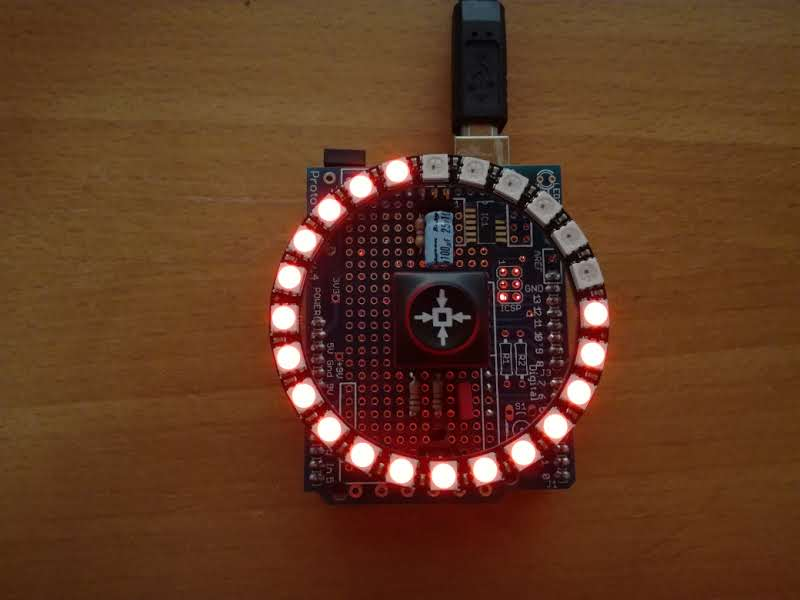

# NeoPomodorino

This is a simple [Pomodoro style timer](https://en.wikipedia.org/wiki/Pomodoro_Technique) I made using a Proto Shield, an Arduino clone, a NeoPixel 24 LED ring clone, and various bits and pieces from my parts drawer.

The single button is wired to pin 3 of the Arduino using a simple RC debounce circuit featured some time ago on [Hackaday](http://hackaday.com/2015/12/09/embed-with-elliot-debounce-your-noisy-buttons-part-i/). It's probably not needed, but what the hell.

The LED ring is wired to pin 6 (like it is in every NeoPixel code example I've seen so far). As suggested a few places, I have a 470 ohm resistor in series with the data pin, and a electrolytic capacitor across VCC and GND. Like the debounce circuit, these are also probably not needed.

### Usage

* Long button presses (> 500ms) will turn the device on and off. This also resets the timer.
* Short button presses will add 1 minute to the current timer. 
* Each pomodoro consists of 25 minutes of work (red color) followed by a short 5 minute pause (yellow color).
* Every fourth pause is a longer one of 25 minutes (green color).
* Between each pomodoro, the device will briefly flash which number is (blue color). 1 quarter of the ring = 1 pomodoro.
